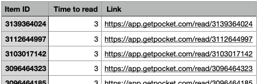

# Pocket Order By "Time to Read"

Simple command line app that retrieves a [Pocket](https://www.getpocket.com/) user's saved items and orders them by "time to read", exporting the results to a csv file. Items with no "time to read" field (e.g. saved twitter links) will be ignored.

I have a lot of stuff saved in Pocket. I like reading the shortest articles first if I don't have the time to spare. Pocket only sorts by oldest/newest. Pocket doesn't have sort by "time to read". I built this.

## How to run

### 1. Install dependencies

Install the dependencies of the `requirements.txt` file in your preferred python3 environment.

```bash
> pip3 install -r requirements.txt
```

### 2. Create a Pocket application

Go to https://getpocket.com/developer/apps/new and create a Pocket developer application with "Retrieve" permissions. A consumer key will be generated for you.

### 3. Add consumer key as an env var

Create a `.env` file in the same directory of `pocket-obttr.py`. Add a single environment variable containing the consumer key of the application you've just created.

```
CONSUMER_KEY=YOUR_APPLICATION_CONSUMER_KEY
```

### 4. Run the app

```bash
> python3 pocket-obttr.py
```

&nbsp;

<p align="center">
  
</p>

<p align="center">
  
</p>
